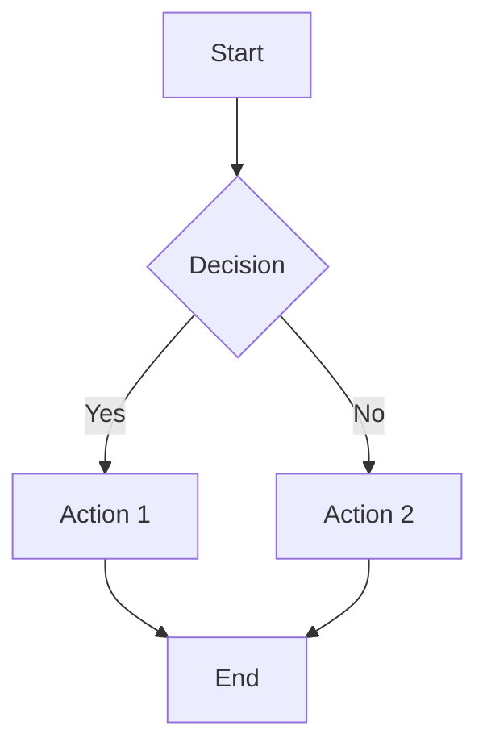

# Contributing to Parallel Research Documentation

Thank you for your interest in contributing to the WiseFlow parallel research documentation! This guide will help you understand how to contribute effectively.

## Table of Contents

1. [Getting Started](#getting-started)
2. [Documentation Structure](#documentation-structure)
3. [Writing Guidelines](#writing-guidelines)
4. [Diagrams](#diagrams)
5. [Code Examples](#code-examples)
6. [Screenshots](#screenshots)
7. [Review Process](#review-process)
8. [Documentation Testing](#documentation-testing)

## Getting Started

To contribute to the documentation:

1. Fork the WiseFlow repository.
2. Clone your fork to your local machine.
3. Create a new branch for your documentation changes.
4. Make your changes following the guidelines below.
5. Commit your changes with clear commit messages.
6. Push your changes to your fork.
7. Create a pull request to the main WiseFlow repository.

## Documentation Structure

The parallel research documentation is organized into the following sections:

- **API Documentation**: Technical reference for APIs and interfaces.
- **User Guide**: End-user focused guides for using the system.
- **Architecture Documentation**: Diagrams and explanations of the system architecture.
- **Developer Guide**: Guides for developers extending or customizing the system.
- **Administrator Guide**: Guides for system administrators.

Before adding new documentation, check the [DOCUMENTATION_STRUCTURE.md](./DOCUMENTATION_STRUCTURE.md) file to see where your contribution fits best.

## Writing Guidelines

### Style

- Use clear, concise language.
- Write in a conversational but professional tone.
- Use active voice where possible.
- Break up long paragraphs into smaller, focused paragraphs.
- Use headings and subheadings to organize content.
- Use lists and tables to present structured information.

### Formatting

- Use Markdown formatting consistently.
- Use backticks for inline code: `variable_name`.
- Use code blocks with language specification for multi-line code:

```python
def example_function():
    return "This is an example"
```

- Use blockquotes for important notes:

> **Note:** This is an important note.

- Use bold for emphasis: **important information**.
- Use italics for definitions or terms: *parallel processing*.

### Structure

- Start each document with a clear title and brief introduction.
- Use a table of contents for longer documents.
- Organize content with headings and subheadings.
- Include examples and use cases where appropriate.
- End with a conclusion or summary where appropriate.
- Include "See Also" links to related documentation.

## Diagrams

Diagrams should be created using Mermaid for easy maintenance and version control.

### Mermaid Diagrams

Use Mermaid syntax for diagrams:



### Diagram Guidelines

- Keep diagrams simple and focused.
- Use consistent styling across diagrams.
- Include a brief explanation of the diagram.
- Use meaningful labels and annotations.
- Ensure diagrams are accessible (include alt text or descriptions).

## Code Examples

Code examples should be clear, concise, and follow best practices.

### Code Example Guidelines

- Include language specification in code blocks.
- Use meaningful variable and function names.
- Include comments to explain complex logic.
- Show complete, working examples where possible.
- Follow the language's style guide (e.g., PEP 8 for Python).
- Include expected output where appropriate.

Example:

```python
# Import the necessary modules
from core.plugins.connectors.research_connector import ResearchConnector
from core.plugins.connectors.research.configuration import Configuration, ResearchMode

# Create a configuration object
config = Configuration(
    research_mode=ResearchMode.MULTI_AGENT,  # Use multi-agent mode for complex topics
    number_of_queries=3,                     # Generate 3 search queries per iteration
    max_search_depth=2                       # Perform 2 iterations of research
)

# Initialize the research connector
connector = ResearchConnector(config)

# Perform research on a topic
results = connector.research("Artificial Intelligence in Healthcare")

# Print the results
print(f"Research topic: {results['topic']}")
print(f"Number of sections: {len(results['sections'])}")
for section in results["sections"]:
    print(f"- {section['title']}")
```

## Screenshots

Screenshots should be used to illustrate UI elements and workflows.

### Screenshot Guidelines

- Use a consistent resolution and window size.
- Crop screenshots to focus on the relevant UI elements.
- Highlight important elements where appropriate.
- Include captions or descriptions.
- Store screenshots in the `images` directory.
- Use descriptive filenames: `dashboard_research_configuration.png`.
- Optimize images for web (compress without significant quality loss).
- Update screenshots when the UI changes.

## Review Process

All documentation contributions go through a review process:

1. **Initial Review**: Basic check for formatting, structure, and completeness.
2. **Technical Review**: Verification of technical accuracy by subject matter experts.
3. **Editorial Review**: Check for clarity, consistency, and readability.
4. **Final Review**: Final check before merging.

### Review Checklist

- [ ] Content is technically accurate
- [ ] Content follows the writing guidelines
- [ ] Diagrams are clear and follow guidelines
- [ ] Code examples are correct and follow guidelines
- [ ] Screenshots are current and follow guidelines
- [ ] Links to other documentation are correct
- [ ] No typos or grammatical errors
- [ ] Documentation structure is maintained

## Documentation Testing

Test your documentation to ensure it's accurate and helpful:

1. **Technical Testing**: Verify that code examples work as described.
2. **Link Testing**: Verify that all links work correctly.
3. **Rendering Testing**: Verify that Markdown renders correctly.
4. **User Testing**: If possible, have someone follow your documentation to verify it's clear and complete.

### Automated Testing

We use automated tools to check documentation quality:

- Markdown linting to ensure consistent formatting
- Link checking to find broken links
- Spell checking to catch typos
- Code example validation to ensure code examples are syntactically correct

## Thank You!

Your contributions to the documentation help make WiseFlow more accessible and easier to use for everyone. Thank you for your efforts!

