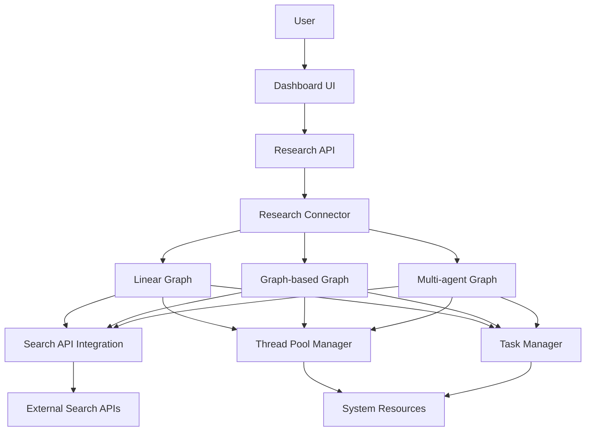
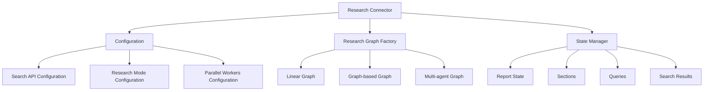
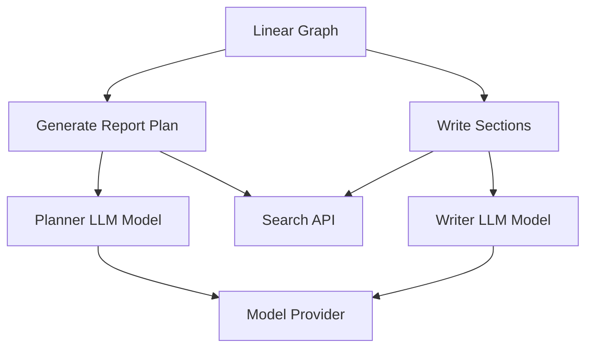
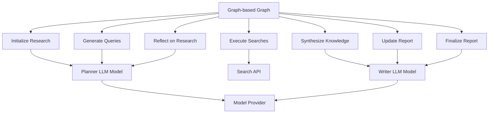
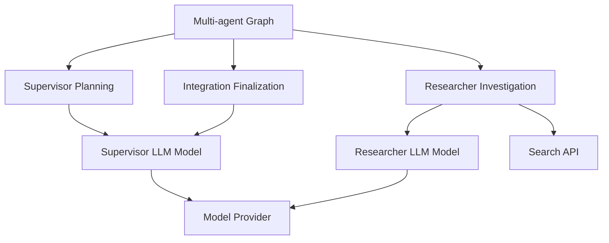
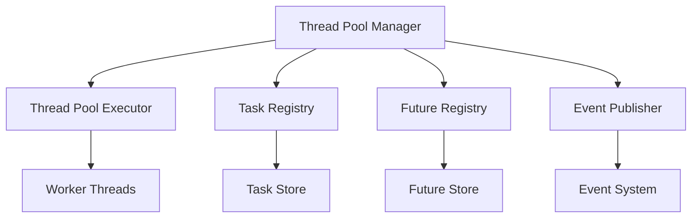
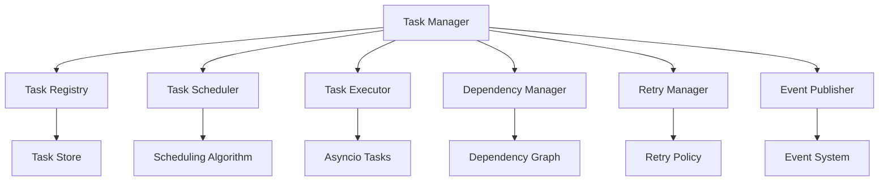
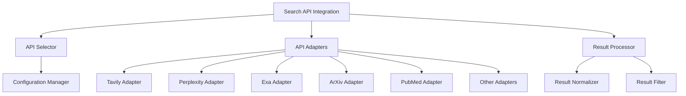
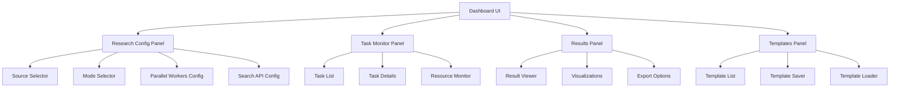
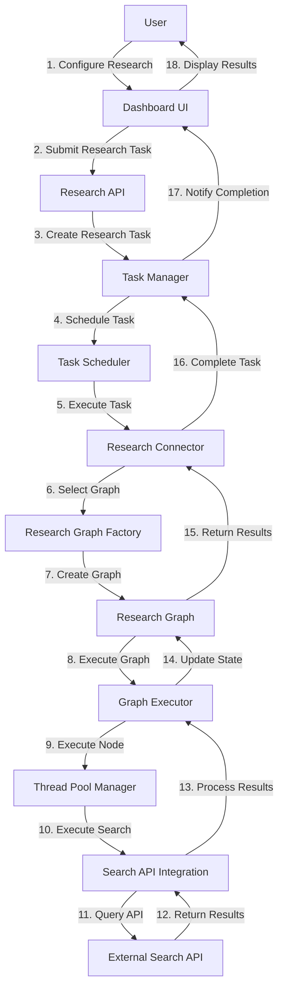

# Component Diagrams

This page provides component diagrams for the parallel research architecture in WiseFlow. These diagrams illustrate the structure and relationships between the major components of the system.

## High-Level Component Diagram

The following diagram shows the high-level components of the parallel research architecture:

## Research Connector Component Diagram

The following diagram shows the components of the Research Connector:

## Linear Graph Component Diagram

The following diagram shows the components of the Linear Graph:

## Graph-based Graph Component Diagram

The following diagram shows the components of the Graph-based Graph:

## Multi-agent Graph Component Diagram

The following diagram shows the components of the Multi-agent Graph:

## Thread Pool Manager Component Diagram

The following diagram shows the components of the Thread Pool Manager:

## Task Manager Component Diagram

The following diagram shows the components of the Task Manager:

## Search API Integration Component Diagram

The following diagram shows the components of the Search API Integration:

## Dashboard UI Component Diagram

The following diagram shows the components of the Dashboard UI:

## Component Interactions

The following diagram shows the interactions between major components during a research task:

## Component Responsibilities

### Research Connector

- Provides the main API for research
- Manages research configuration
- Selects and executes the appropriate research graph
- Handles research state management

### Research Graphs

- Define the workflow for different research modes
- Manage the execution of research nodes
- Handle state transitions between nodes
- Implement the research logic for each mode

### Thread Pool Manager

- Manages a pool of worker threads
- Executes CPU-bound tasks concurrently
- Tracks task status and results
- Publishes events for task lifecycle

### Task Manager

- Manages asynchronous tasks
- Handles task scheduling and prioritization
- Manages task dependencies
- Implements retry logic and timeout handling

### Search API Integration

- Provides a unified interface to multiple search APIs
- Handles API authentication and rate limiting
- Normalizes search results from different APIs
- Implements fallback mechanisms for API failures

### Dashboard UI

- Provides a user interface for configuring research
- Displays task status and progress
- Visualizes research results
- Manages research templates and presets

## See Also

- [Architecture Overview](./architecture_overview.md)
- [Data Flow Diagrams](./data_flow_diagrams.md)
- [Sequence Diagrams](./sequence_diagrams.md)
- [Architecture Decisions](./architecture_decisions.md)

